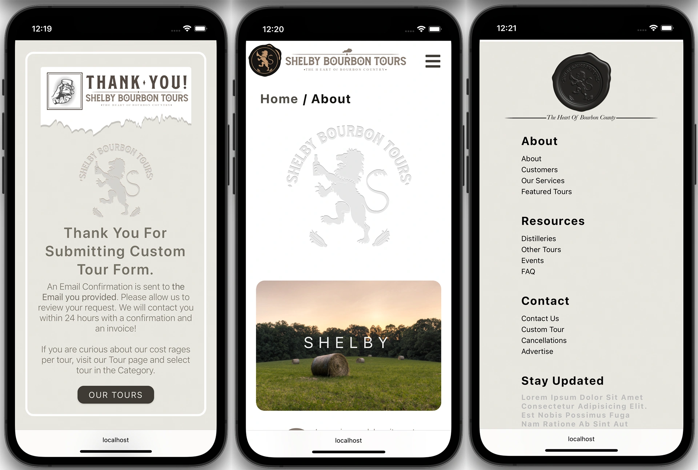

# <center> React Static Web Application </center>

<p align="center">
  
</p>

#### Static Web Application Built/Managed For A Touring Company. This application is designed to be responsive on the web and mobile devices. Multiple contexts are used in this project. Context eliminates nested components by giving components hooks that can be called upon without passing down the props. Additionally, Styled-components are used in this project to manage the CSS quickly. Styled components leverage a mixture of JavaScript and CSS using a technique called CSS-in-JS for user Authentication Auth0 is used. Auth0 is a flexible, drop-in solution to add authentication and authorization services to your applications. It is a single sign-on (SSO) solution for web applications. To create a secure checkout, a PrvareRoute is created where a Stripe component is embedded. Stripe is a payment services provider that lets merchants accept credit and debit cards or other payments.

## Support

Find the App Useful? [Visit My Site](https://www.denysladden.com/)

## Initial Set Up

#### Run The App Locally

```sh
npm run install-dependencies
```

- rename .env.temp to .env

```sh
npm start
```

- visit url http://localhost:3000/

#### Setup React App

- create <b>client</b> folder
- open terminal

```sh
cd client
```

```sh
npx create-react-app .
```

```sh
npm start
```

- set editor/browser side by side
- copy/paste assets from complete project# Jobify

#### Static Page Application with API

#### Run The App Locally

```sh
npm run install-dependencies
```

- rename .env.temp to .env
- setup values for - MONGO_URL, JWT_SECRET, JWT_LIFETIME

```sh
npm start
```

- visit url http://localhost:3000/

# Table Of Contents

## - [React](#react)

## - [React Router](#router)

## - [Design: UI/UX](#ux)

## - [Auth0](#auth)

## - [Stripe](#stripe)

## - [SEO](#seo)

## - [Database](#data)

## - [Screen Captures](#media)

## - [Helpful Links](#links)

## - [Project Dependencies](#dep)

<a id="react"></a>

# React

React is an excellent choice for building static web applications due to its speed, efficiency, and extensive ecosystem. By breaking down the UI into reusable components and using a virtual DOM, React allows for the creation of complex and interactive UIs with improved performance. Its popularity and large community also provide developers with plenty of resources and third-party libraries to help speed up development and add additional functionality to their app. Overall, React's strengths make it a great option for building static web applications.

## React Components: https://17.reactjs.org/

### React Context API

Multiple context are used in this project. Context eliminates nested components by
giving components hooks which can be called upon without passing down the props.
Context creates avaivality through the whole application for components.
https://reactjs.org/docs/context.html

### useReducer

useReducer is another hook used for the modern state management in React.
Reducers Specify how the apps state changes in response to action sent to the store. It
is a function that accepts (state, action) as argument and then returns the next state of
the application. This concept was introduced in Redux first and then it is adapted by
React as well. Typically, reducer is a function which accepts two arguments - state and action. Based on the action provided, reducer will perform some operations on a state and returns a new updated state. In context of React, useReducer also performs similar state management. You can read more about useReducer in detail in the documentation: https://reactjs.org/docs/hooks-reference.html#usereducer

<a id="router"></a>

### Rect Routing

In a typical website all requests are sent to the server and server continuously
responds. In a react.js application using ReactDom a simple response can be a full JS
bundle. It is dispatched after a request and houses all the components, react Router
then injects these components bypassing the server request. React Router eliminates
server requests by intercepting them when possible and developing needed
components for the page that the user requested. This makes for lightning fast website
as the React js bundle has all that is needed dynamically. Great article on this can be found here: https://www.freecodecamp.org/news/how-to-use-react-router-version-6/#:~:text=To%20install%20React%20Router%2C%20all,%2Drouter%2Ddom%406%20

## Protect a route

Protect a route component using the withAuthenticationRequired higher order
component. Visits to this route when unauthenticated will redirect the user to the
login page and back to this page after login.

React Access Restrictions
https://reactjs.org/docs/accessibility.html

The Complete Guide to React User Authentication with Auth
https://auth0.com/blog/complete-guide-to-react-user-authentication/

### Dispatching

Dispatching is a fundamental part of Redux, which is a predictable state container for JavaScript applications. When an action is dispatched in a React-Redux application, it is sent to the Redux store, which updates the application state based on the action type and payload. This allows for a centralized and predictable way of managing state in a React application, making it easier to reason about and debug. What Even Is A Dispatch Function?: https://dev.to/dustinmyers/what-even-is-a-dispatch-function-27ma

### Code Examples

#### useEffect

useEffect is a powerful feature in React that allows developers to handle side effects in functional components. It enables data fetching, DOM manipulation, and other side effects that would otherwise be possible only in class components. The dependency array in useEffect provides granular control over when the effect runs, improving performance and avoiding unnecessary renders.

### useEffect: Dependency Array vs No Dependency Array

`useEffect(() => {
performSideEffect();
}, []);`

`useEffect(() => {
performSideEffect();
});`

- Giving it an empty array acts like componentDidMount as in, it only runs
  once.

- Giving it no second argument acts as
  both componentDidMount and componentDidUpdate, as in it runs first on mount
  and then on every re-render.
- Giving it an array as second argument with any value inside, eg ,
  [variable1] will only execute the code inside your useEffect hook ONCE on mount, as
  well as whenever that particular variable (variable1) changes.
  You can read more about the second argument as well as more on how hooks actually
  work on the official docs at https://reactjs.org/docs/hooks-effect.html

<a id="ux"></a>

# UI/UX

### STYLING:

Styled-components is a library built for React and React Native developers. It allows
you to use component-level styles in your applications. Styled-components leverage a
mixture of JavaScript and CSS using a technique called CSS-in-JS. Styled-components
is a good development experience (at least for me), and that’s the whole point of it. If
you find other ways of styling a react component to be unintuitive, styled-
components can be a good alternative for you

Styled-Components (lets you write actual CSS in your JavaScript):
https://styled-components.com/

Basics of Styled-Components
https://styled-components.com/docs/basics

Netlify Redirects and Rewrites
https://docs.netlify.com/routing/redirects/

<a id="auth"></a>

## Auth

Auth0 is a flexible, drop-in solution to add authentication and authorization services
to your applications. It is single sign on (SSO) solution for web applications. Rather
than having depend on the login in options for any given application, you can have
Auth0 be your front end and handle logins for you. Auth0 can be great if a web
application does not have some of the features that you want for security such as like
2FA.

Moreover, it allows you to eliminate the need for users to have a dozen separate sets
of credentials for a dozen different web portals. User just use their single Auth0 login
for every application.

It works by integrating with the web application itself. Auth0 ensures that your login
is correct, then it will pass a token to the web app saying "User user234 has been
authenticated”. Allow user access to the application. The web app is configured to
acknowledge this token as legitimate therefore user234 is allowed access to the
application.

## Auth0 Quick-Starts & Tutorials:

Authentication and user Login:
https://auth0.com/docs/quickstart/spa/react

Auth0 React SDK for Single Page Apps
https://auth0.com/docs/libraries/auth0-react

React: Login
https://auth0.com/docs/quickstart/spa/react/01-login

How Auth0 and Netlify work together:
https://www.netlify.com/integrations/auth0/

### Change storage options

The Auth0 SPA SDK stores tokens in memory by default. However, this does not
provide persistence across page refreshes and browser tabs. Instead, you can opt-in to
store tokens in local storage by setting the cacheLocation property
to localstorage when initializing the SDK. This can help to mitigate some of the
effects of browser privacy technology that prevents access to the Auth0 session
cookie by storing Access Tokens for longer

## Authenticating Social Connections on Auth

What is SAML?
Security Assertion Markup Language 2.0 is a version of the SAML standard for
exchanging authentication and authorization identities between security domains.
SAML is used to provide federated authentication, as a digital passport. If I want to
provide a service lots of different people can use, I need to be able to know who they
are, especially if I am storing things for them. The traditional way to solve this is
creating an account for each user with a username and password. This can be a pain to
manage, is annoying for users to have a million different accounts, and can be a
security hole. It can also be difficult to work into low-level services that operate
below the user level.

How SAML Authentication Works, and Why It’s Still Relevant for Enterprise
Customers?
SAML 2.0 (Security Assertion Markup Language) is an open standard created to
provide cross-domain single sign-on (SSO). In other words, it allows a user to
authenticate in a system and gain access to another system by providing proof of their
authentication.

<a id="stripe"></a>

# Stripe

Stripe is a payment services provider that lets merchants accept credit and debit cards
or other payments. It is used by some of the world’s largest companies, including
Amazon and Shopify. To better understand what Stripe is, you should first know
what a payment gateway is. On an e-commerce site or mobile app, you take the
customer’s billing information and pass it along to a payment gateway. A payment
gateway is an intermediary between the credit/debit card companies and the business
account. The payment gateway confirms that the charge can be made for the given
card information and sends the charge details to the business account. The same
charge details are also passed to the app making the payment request. Stripe is one of
the prime payment gateways. It enables businesses and individuals to accept payments
using their rich API and robust platform.

## Netlify and Stripe

To make a secure connection and not just use your own API this project utilizes
netlify functions to set up a netlify server which will handle the secure checkout with
Stripe. Netlify function behaves as a middle man connection for security purposes.

## Stripe Custom Payment Flow

Stripe allows you to embed a custom payment form in your website or application.
The client- and server-side code builds a checkout form with elements to complete a
payment using various payment methods. https://stripe.com/docs/payments/quickstart

## Stripe Quick-Starts & Tutorials:

Stripe.js Reference: https://stripe.com/docs/js

<a id="seo"></a>

# SEO: About Search Engine Optimization

In this project react-helmet-async is used for SEO optimization.

SEO: SSR Server Side Rendering vs Pre-rendering
For the longest time, I did not understand the term Static Application since in my
slim knowledge of web development server is the main output of any application
delivered on the web. However, Static application is simply application which is not
reliant on connection to an online server or database. These apps built in this way are
downloaded once, usually periodically updated, and are able to function offline only
with the device on which they are installed. What does this have todo with SEO?
Web pages are crawled by google this is where the ranking is determined. Server-side
rendering means that a website’s JavaScript is rendered on the website’s server. To use
the furniture example again, this would be like ordering furniture that arrives at your
house fully assembled. Sending fully-rendered pages to search engine bots also means
that you’re not risking the “partial indexing” that can happen with client-side
rendered content. When Google and other search engine bots try to access your page,
instead of having to wait for rendering resources to become available before seeing
your full page, they’ll get the fully-rendered page right from the get-go. So, SSR
compiles and renders pages on the server on-demand when the page is requested,
however another option is pre-rendering which compiles and renders pages on the
server at build time/when deployed. The mandatory server for a universal app can be
a deterrent for some and may be overkill for a small application. This is why pre-
rendering can be a really nice alternative. But the real solution is NextJS. Beyond pre-
rendering it offers many other features such as their image tag and a file-based router.
If you ever want to switch from SSG to ISR or SSR, it's a mere matter of adding some
data-fetching routes and specifying some params.

<a id="data"></a>

# The Database:

### This Application uses Serverless Functions to fetch the data from a non-relational data base. Here is an example of the functions at use to fetch this data: https://github.com/dladden/sereverless-functions-react

To fetch data from Airtable using Netlify functions, use the Airtable API to query the relevant data, and then use Netlify's serverless functions to retrieve and process the data. To get started, you'll need to create a new Netlify function and set up the Airtable API credentials. Once you have that set up, you can use the axios package to make a GET request to the Airtable API and retrieve the data. After that, you can process the data however you like and return it to the client. Make sure to handle any errors that may occur during the process and include appropriate error handling in your code.

This Project uses theses fields:

- name - name of the tour
- dist - distillery
- price - price of the tour
- available - checkmark for if the tour is available
- best_sell - best sellers
- images - tour images
- featured - tours listed on the home page
- category - category of each listing ie: tour, stay, food, event
- trans - transportation for the tours
- stars - review based on 0.5 rating
- spec_res - special reservation checkmark for any listings that require reservation outside of the site
- tour_url - url to tour listing on facebook
- rev_url - url to where the reviews came from in this case facebook
- guest - limit of guests per tour

Example of the Fields in the Database:

| name      | dist                  | price | available | best_sell | images      | featured |
| --------- | --------------------- | ----- | --------- | --------- | ----------- | -------- |
| Best Tour | Makers Mark, Jim Beam | 40000 | ✓         | ✓         | image01.png | ✓        |

<a id="media"></a>

# Screen Captures

<p align="center">
  
</p>

<p align="center">
  
</p>

<a id="links"></a>

# Helpful Links:

Intl.NumberFormat
https://developer.mozilla.org/en-
US/docs/Web/JavaScript/Reference/Global_Objects/Intl/NumberFormat

Making Asynchronous HTTP Requests in JavaScript with Axios:
https://stackabuse.com/making-asynchronous-http-requests-in-javascript-with-axios/

Components and Props
https://reactjs.org/docs/components-and-props.html

Conditional Rendering
https://beta.reactjs.org/learn/conditional-rendering

Conditional Rendering (docs)
https://reactjs.org/docs/conditional-rendering.html

JavaScript Sorting Arrays
https://www.w3schools.com/js/js_array_sort.asp

React ES6 Spread Operator
https://www.w3schools.com/react/react_es6_spread.asp

Sorting in React JS
https://owlcation.com/stem/creating-a-sortable-list-in-react-js

What is a DNS CNAME record?
https://www.cloudflare.com/learning/dns/dns-records/dns-cname-record/

Using Netlify lambda functions to send emails
https://dev.to/char_bone/using-netlify-lambda-functions-to-send-emails-from-a-
gatsbyjs-site-3pnb

Securing Netlify Functions with serverless-jwt and Auth
https://sandrino.dev/blog/securing-netlify-functions-with-serverless-jwt

React SEO
https://www.youtube.com/watch?v=wWeG8rWkMsM

<a id="dep"></a>

# Dependencies & Synk Advisor Ratings:

react-helmet-async
https://www.npmjs.com/package/react-helmet-async

Synk Advisor: react-helmet-async
https://snyk.io/advisor/npm-package/react-helmet-async

react-slideshow-image v4.1.
https://www.npmjs.com/package/react-slideshow-image

Synk Advisor: react-slideshow-image
https://snyk.io/advisor/npm-package/react-slideshow-image

react-select
https://www.npmjs.com/package/react-select

Synk Advisor: react-select
https://snyk.io/advisor/npm-package/react-select

REACT DATE PICKER:
https://www.npmjs.com/package/react-datepicker

Synk Advisor: react-calendar
https://snyk.io/advisor/npm-package/react-calendar

React Router Hash Link
https://www.npmjs.com/package/react-router-hash-link

Synk Advisor: react-router-hash-link
https://snyk.io/advisor/npm-package/react-router-hash-link

react-google-recaptcha
https://www.npmjs.com/package/react-google-recaptcha

Synk Advisor: react-google-recaptcha
https://snyk.io/advisor/npm-package/react-google-recaptcha

disable-react-devtools
https://www.npmjs.com/package/@fvilers/disable-react-devtools

Synk Advisor: disable-react-devtools
https://snyk.io/advisor/npm-package/disable-react-devtools
